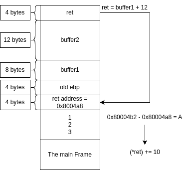

- [Introduction](#introduction)
- [Notes on Part 1 (ch 1-5)](#notes-on-part-1-ch-1-5)
  - [Ch 1](#ch-1)
  - [Ch 2](#ch-2)
  - [Ch 3](#ch-3)

# Introduction
In this repo I host my notes for The **Shellcoder's Handbook: Discovering and Exploiting Security Holes**. It can be purchased from here for example: https://www.wiley.com/en-us/The+Shellcoder's+Handbook%3A+Discovering+and+Exploiting+Security+Holes%2C+2nd+Edition-p-9781118079126#downloadstab-section
or elsewhere as well. 

Side notes:
1. For the beginning of the journey look here: https://github.com/RegistersNinja/coding_from_groundup
2. There is a good accompanying course that can be found here: https://www.samsclass.info/127/127_S23.shtml. I think following some external up-to-date resource with this book is a must, because it's a bit old. 
3. A note on this book: it's old and that is true. Most resources on the internet (i.e reddit & quora) say it's still relevant. They do however mention that it can be a tough read for various reasons, as well as it's worthwhile to do research on topics from the book. A repeated message is that basically the exploitations have not changed, but the defense systems have been enhanced/put in place where they were not.
# Notes on Part 1 (ch 1-5)
## Ch 1
Interesting notes from Sam: 
1. registers like AL or AH (or smaller segments of larger registers) typically do not concern developers, they are however **important to hackers**. If you want to inject shellcode into a text field, something like 0xB942000000, the last zero bytes (that are extended to fill the bigger register) act like null terminating string bits, thus terminating your code prematurely.
2. ROP chains - an attack that injects code in a data field, but since that area of the code is not executable, the injection is just addresses where there is some code you would want to execute.
3. Since not covered previously, lea is an important mnemonic. By definition it calculates the address of something without looking it up. From [handmade.network](handmade.network): 

        lea stands for "load effective address", and it is the assembly equivalent of &. If mov destination, [source] means "look up the element at address [source] and copy it to destination", lea destination, [source] means "just get the address [source]."
4. NOP instruction - means No Operation. Originally used to pad instructions that had to be a certain word length. Used by hackers as something called a NOP sled, that helps them navigate the memory of the target machine. Has to be explored further.
5. In linux there is one heap for everything. In windows it's more complicated and there can be many heaps.

## Ch 2
Notes from the book:
1. When compiling and running buffer2.c, the program exits with code 134 (SIGABRT) and reports:
    
        *** stack smashing detected ***: terminated
    Further reading can be found here: https://stackoverflow.com/questions/1345670/stack-smashing-detected and it appears that this is a compiler protection.
    Interestingly enough, the error in the book itself is Segmentation Fault, that has a completely different meaning. More on that here: https://en.wikipedia.org/wiki/Segmentation_fault.
2. Regarding the stack:
   1. POP does not alter the stack, rather copying the values from the top of the stack into the operands (registers) and adding 4 bytes to the esp pointer, moving it backwards.
   2. As a reminder - ebp is used a relative pointer for accessing data on the stack.

Notes from Sam:
1. gcc compiling with -g switch allows gdb debugging with source code.
2. Bunch of useful gdb commands: 
   1. list - show the source code.
   2. run - execute program (stops at breakpoint).
   3. break - insert breakpoint.
   4. x - examine memory.
   5. disassemble - disassembles a symbol
   6. continue - resumes execution after breakpoint
   7. info proc mapping - info is a generic command to show information. The full command lists memory regions mapped by the specified process.
   8. info registers - self explanatory.
   9.  set disassembly-flavor [x] - at&t by default, can switch to intel.
3. disable ASLR with this command: sudo echo 0 > /proc/sys/kernel/randomize_va_space
4. I was able to reproduce some of the demonstrations in a VM, but modern OS and compilers (gcc) are good at detecting stack overflows. Modern mitigation includes Stack Canaries, ASLR, PAC on ARM (although recently was also found to be vulnerable, see here: https://arxiv.org/pdf/2406.08719).

Notes from "Smashing the Stack For Fun and Profit" by Aleph One - The overflow chapter:
1. You can download the paper from here: https://inst.eecs.berkeley.edu/~cs161/fa08/papers/stack_smashing.pdf.
2. To conduct the overflow in a controlled manner (and not just corruption) you have to calculate the offset correctly. It's not that difficult in simple programs, but becomes increasingly harder. Here is a little diagram for example3.c:
   

The idea is simple: calculate the offset from the buffer you are overflowing until you reach the return address. This includes the relevant local variables (note they are *word sized) + the base pointer. Then you can modify the return address directly.
Using the same principle, you can just corrupt the return address, but in that case not a lot of caution required (bunch of As' as an example).

## Ch 3
